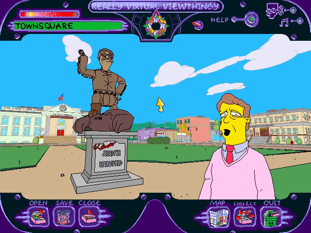
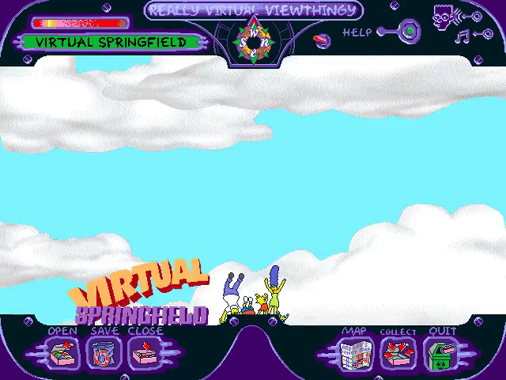
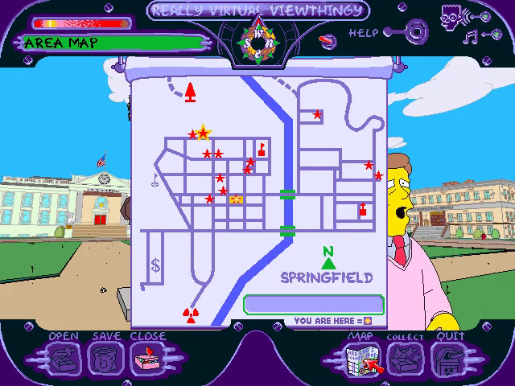
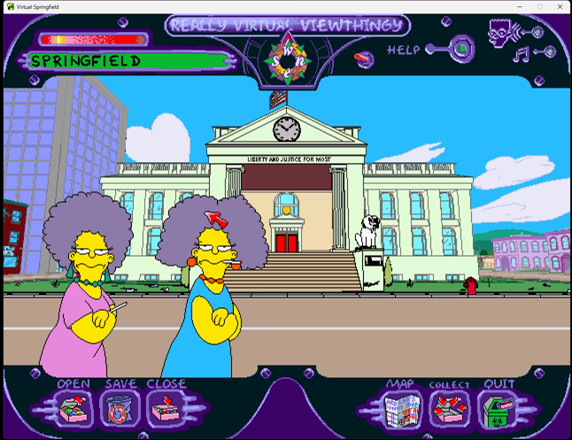
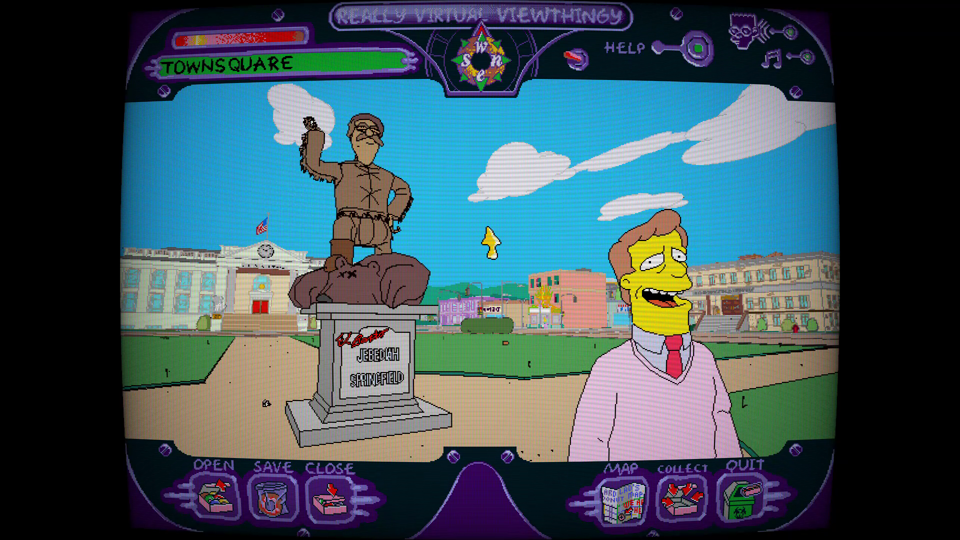

# The Simpsons: Virtual Springfield — Static Recompilation



Static recompilation of **The Simpsons: Virtual Springfield** (Fox
Interactive, 1997), the point-and-click tour of Springfield, from its
shipping Win32 executable to native C that runs on Windows 10 and 11.

Built on the [pcrecomp](https://github.com/sp00nznet/pcrecomp) toolchain and
following its shared house style (layout, CLI, conformance harness, headless
mode).

## Status: **v0.1.0-dev, alpha. Boots, plays the intro and lets you walk Springfield, recompiled throughout.**

| Stage | State |
|---|---|
| P0: identify the binary | done: `VIRTUAL.EXE`, MSVC 4.2, no protection, no DLLs of its own |
| Function catalog (`disasm32`) | 793 functions, 68.4% of the code bytes |
| Lift (`run_lift.py`) | **whole program**: 832 functions, 0 lift errors, 201K lines of C. pcrecomp `main`, no toolkit change |
| Host (`build/virtualspringfield.exe`, 32-bit, pcrecomp `native32`) | 109 imports: 99 bound to real Windows, 10 shimmed. Nothing native from the original runs |
| Install check | passes with no installer and no registry: the host answers the paths itself ([docs/host.md](docs/host.md)) |
| Graphics | the host's own DirectDraw: the exclusive 640x480 8-bit mode becomes a window, palette fades included ([docs/display.md](docs/display.md)). The **presenter** scales it on Direct3D 11: sharp/smooth/nearest/integer/Scale2x, borderless fullscreen (F11), CRT, glow, dithering, vivid colour ([docs/presenter.md](docs/presenter.md)) |
| Intro, title, Town Square | **run**: the Fox Interactive and Vortex logos, the title, Troy McClure's welcome |
| Getting around | clicking works: the area map, walking to other places. Not yet played through |
| Sound and music | DirectSound and the `midiStream` music open and stream with no error. **Not yet checked by ear** |
| Windowed mode | runs, in a resizable window with a **Video** menu; settings in `build\virtualspringfield.ini` |
| Headless mode | `--headless --record out.mp4`, with `--click` and `--key` for scripted input. Never shows or activates a window ([docs/display.md](docs/display.md)) |
| Conformance harness | **11/11** milestones (boot, install check, DirectDraw mode, 1,000 frames, a click on MAP opening the area map, idle at 95 s with no fault), 0 lift errors, 0 unresolvable tail calls, 0 unimplemented DirectDraw calls ([tools/conformance.py](tools/conformance.py)) |

## Screenshots

Real output of `build\virtualspringfield.exe`, recompiled code throughout
(headless recordings, and a windowed run from before the presenter):

| | |
|---|---|
|  |  |
|  |  |

The presenter, fullscreen with the CRT look on (pillarboxed 4:3 on a
1920x1080 screen):



## What's added on top

Things the 1997 game never had, all of it host code beside the recompiled
game (`src/runtime/`); none of it changes the game itself.

**The presenter.** The game drew into an exclusive 640x480 8-bit screen.
The port shows that picture in a resizable Direct3D 11 window: sharp,
smooth, nearest, integer or Scale2x scaling, borderless fullscreen (F11 or
Alt+Enter), a CRT effect with curvature, a glow on bright colours, 16-bit or
8-bit retro dithering, and vivid colour. Clicks land where the pointer is at
any size. The filters and CRT come from Hover! and gunman, Scale2x and the
glow from SimCity 2000 ([docs/presenter.md](docs/presenter.md)).

**No install, no disc.** The original wanted its installer's registry
entries and the CD in the drive. The port runs from one folder.

**Headless and recording.** `--headless --record out.mp4 --click ...` plays a
scripted run without showing a window. The screenshots above were made this
way.

## What is not in this repo

Nothing from the game: no executable, no data, no disc image, and **no
generated source**. The recompiled C is produced on your machine from your
own copy by `run_lift.py`, into `src/recomp/gen/`, which is gitignored. The
tool ships; its output never does.

## Getting Started

You need **your own copy of Virtual Springfield**: the CD, a BIN/CUE or ISO
of it, or a zip holding either (the archive.org-style zip with the BIN/CUE
inside works as it is). Nothing is downloaded for you.

### Quick start

1. Download this repository (the green **Code** button, then **Download ZIP**)
   and unzip it somewhere with 2 GB free.
2. Double-click **`Setup.cmd`**.

It checks for Python 3.10+, the `pefile` and `capstone` packages, the pcrecomp
toolkit and the Visual Studio 2022 C++ compiler, and **asks** before
installing any of them, saying what and how big. It finds the CD in your
drives, or asks where the game is (a drive, a `.cue`/`.bin`/`.iso`, a `.zip`,
or a folder). Then it copies the game into `game\virtual`, finds every
function, recompiles `VIRTUAL.EXE` and builds `build\virtualspringfield.exe`.
A rerun skips the finished steps. If it stops, it says why in one sentence,
and the details are in `setup.log`.

It ends with a **`Virtual Springfield`** shortcut in the folder.
Double-click it to play.

### Step by step

Prerequisites: Windows 10/11, **Python 3.10+** (`py -3 --version`), **git**,
**Visual Studio 2022** (or its Build Tools) with *Desktop development with
C++*, **ffmpeg** on `PATH` for `--record` only, and the pcrecomp toolkit
cloned **beside** this repository as `tools`:

```
some-folder\
  tools\                        <- git clone https://github.com/sp00nznet/pcrecomp tools
  virtualspringfield\           <- this repository
```

1. Python packages:
   ```
   py -3 -m pip install --user pefile capstone
   ```
2. Your copy's files into `game\virtual` (from a drive, a disc image, a zip or
   a folder):
   ```
   py -3 tools\gamefiles.py E:\
   py -3 tools\gamefiles.py "Virtual Springfield.cue"
   py -3 tools\gamefiles.py VirtualSpringfield.zip
   ```
   Expected, for the zip:
   ```
   unpacking Virtual Springfield.bin from VirtualSpringfield.zip (740 MB)
   reading 4291 files (593 MB) from ...\work\vs-disc-...\Virtual Springfield.bin at VIRTUAL/
   done: ...\game\virtual
   ```
3. The function catalog (a few seconds):
   ```
   py -3 tools\catalog.py
   ```
   Expected, at the end: `[*] Functions: 793  (thunks=3, leaves=262)`.
4. Recompile to C:
   ```
   py -3 run_lift.py
   ```
   Expected:
   ```
   [*] VIRTUAL.EXE: base=0x00400000 code=0x00401000-0x00429200 IAT=109 catalog=793
   [*]   39 outside branch targets added
   [*] 0 patches applied at 0 sites
   ============================================================
     lifted 832   errors 0   no terminator 0
   ```
5. Build (the 64-bit-hosted MSVC targeting x86, CMake and Ninja; all three come
   with the C++ workload):
   ```
   build.cmd
   ```
   Expected: `Linking C executable virtualspringfield.exe`.
6. Check it without opening a window:
   ```
   build\virtualspringfield.exe
   ```
   Expected: `[bind] 0x00400000: 99 native, 0 guest, 10 shimmed, 0 unresolved`
   and `(dry run: image mapped and bound; --run enters 0x0041CE00)`.
7. Play: `build\virtualspringfield.exe --run`.

The usual trip-ups: `python` opening the Microsoft Store (that is Windows' alias
placeholder; use `py -3`, or turn the alias off in *Settings > Apps > Advanced
app settings > App execution aliases*); a freshly installed Python not being on
`PATH` until you open a new window; and an installed copy of the original
(`C:\Program Files\FOX\Virtual Springfield`) as the game folder: it has no
`DATA\`, which stayed on the CD. Use the CD or an image of it.

## Usage

```
build\virtualspringfield.exe --run                            # play, in a window
build\virtualspringfield.exe --run --headless --record out.mp4 --click 450,445@75000 --watchdog 95
build\virtualspringfield.exe --run --headless --watchdog 60 --native-trace   # every Windows call
py -3 tools\conformance.py                                    # milestones and lift health, vs the baseline
```

In the game: click to look around and walk, MAP for the area map, COLLECT for
the cards you have found, OPEN/SAVE for the twelve save slots, QUIT to leave.
The intro plays by itself (about 70 seconds).

The **Video** menu (and `[video]` in `build\virtualspringfield.ini`, written
with its defaults on the first windowed run) holds the filter, window size,
fullscreen, CRT, glow, dithering, vivid colour, and whether the game pauses
when its window loses the focus. F11 or Alt+Enter toggles fullscreen.

| Flag | |
|---|---|
| `--run` | enter the game (without it: map, bind and stop) |
| `--headless` | a cloaked window that never reaches a screen or takes focus; message boxes go to stderr |
| `--record out.mp4` | pipe the screen to ffmpeg (640x480, 30 fps, wall-clock paced) |
| `--frames N` | exit after N presents |
| `--shot N:file.bmp` | save present N exactly as the game drew it |
| `--diff A,B` | print how much of the screen changed between A and B ms after start |
| `--click X,Y@MS` | click at a 640x480 position, MS milliseconds after entry |
| `--key NAME@MS[+HOLD]` | press a key MS milliseconds after entry, for HOLD ms (default 100): `ESC`, `SPACE`, `F1`, a letter, or a VK code |
| `--scale N` | the window's client area is 640x480 times N, this run only (default: the ini's `scale`, or the largest that fits) |
| `--game DIR` | the game folder (default `game\virtual`) |
| `--watchdog S` | stop after S seconds and say where every thread was |
| `--native-trace`, `--callbacks`, `--ddraw-trace` | one line per call into Windows, back from it, or into the host's DirectDraw |

`py -3 tools\addr2line.py ADDR ...` names host addresses from a fault report
or a watchdog dump.

## Building from source

Steps 3 to 5 above. `PCRECOMP` (Python) and `-DPCRECOMP=` (CMake, through
`set CMAKE_ARGS=...` for `build.cmd`) point at a toolkit checkout other than
`..\tools`; the lifter and the runtime must come from the same tree. How the
pieces fit is [docs/architecture.md](docs/architecture.md); what the host
does and why is [docs/host.md](docs/host.md),
[docs/display.md](docs/display.md) and [docs/presenter.md](docs/presenter.md). What is next: [ROADMAP.md](ROADMAP.md).

## License

MIT, for the code in this repository ([LICENSE](LICENSE); what it does not cover is in [NOTICE](NOTICE)). The Simpsons:
Virtual Springfield is © 1997 Twentieth Century Fox Film Corporation and
Fox Interactive; none of it is here.
